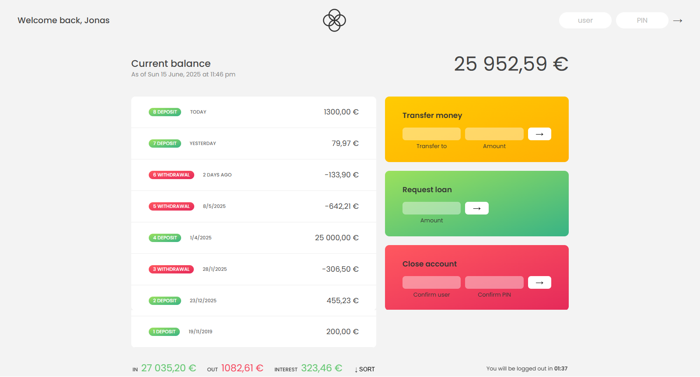

# Bankist App 💰

A fictional online banking interface built as part of my JavaScript learning journey. This project was created while following along with Jonas Schmedtmann’s JavaScript course on Udemy.

> ⚠️ **Disclaimer:** This is not my original project. It was developed by [Jonas Schmedtmann](https://www.udemy.com/user/jonasschmedtmann/) as part of his Udemy course: *"The Complete JavaScript Course."*  
> I followed along, wrote the code myself, and used it as a practical way to solidify core JavaScript concepts.

---

---

## 🚀 Features
- View and sort transactions (deposits & withdrawals)
- Display formatted dates and currencies based on user locale
- Transfer money between accounts
- Request a loan
- Auto logout timer for security
- Close/delete account

---

## 📚 What I Learned
- DOM manipulation and event handling
- Date and time formatting with `Intl.DateTimeFormat`
- Currency formatting with `Intl.NumberFormat`
- Array methods like `.map()`, `.filter()`, `.reduce()`
- Better structuring of real-world JS apps

---


---

## 📂 Setup

To run this locally:

```bash
git clone https://github.com/nandshiv/Bankist-app.git
cd bankist-app
open index.html
